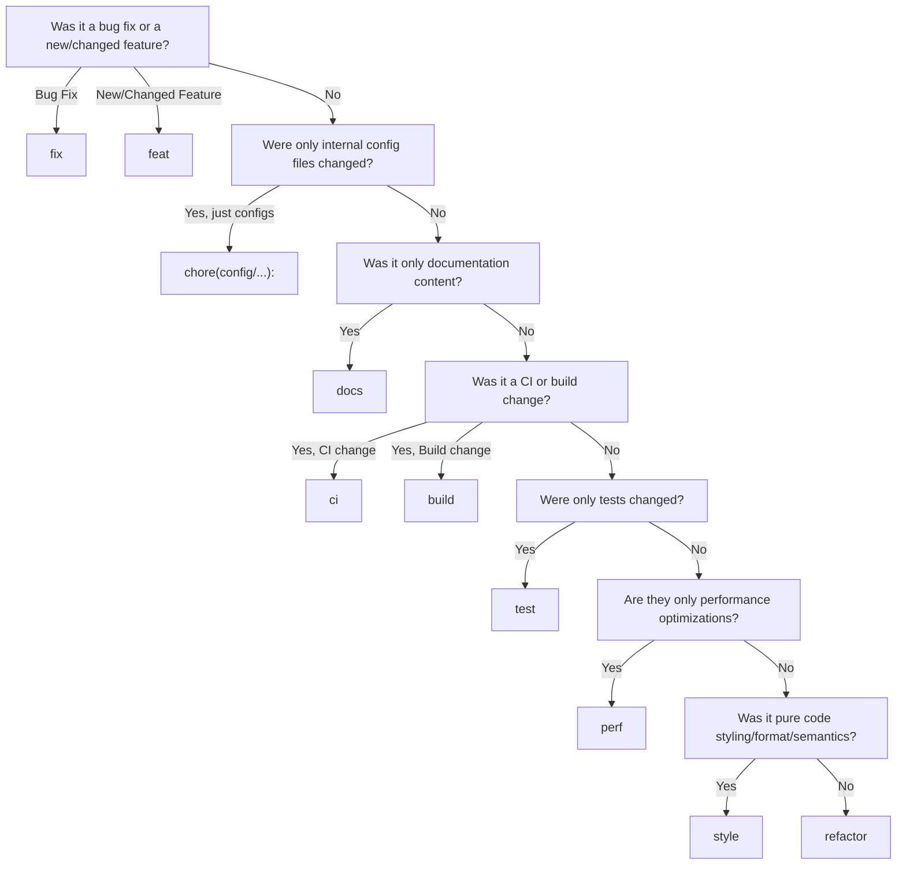
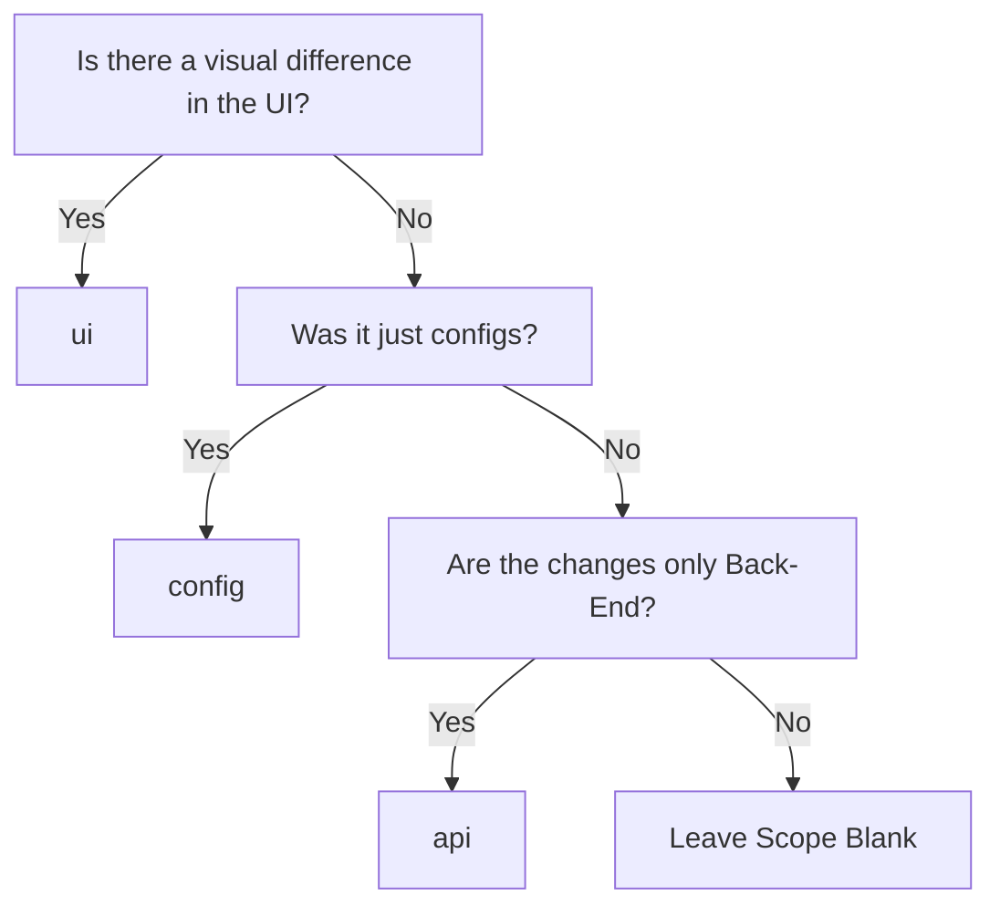
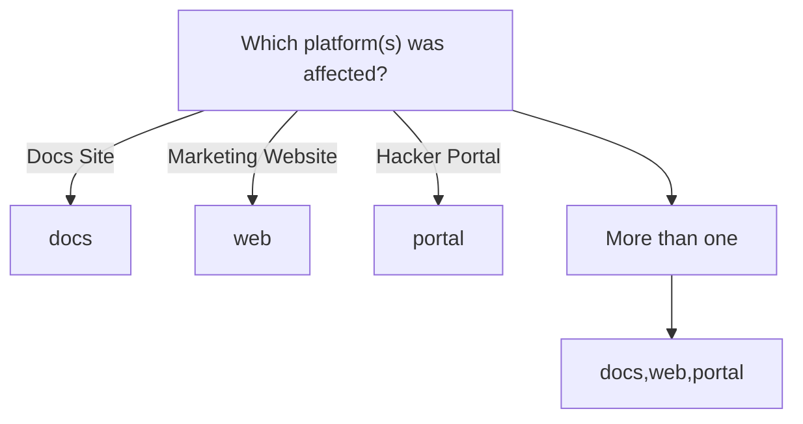

import { Accordion, Accordions } from "fumadocs-ui/components/accordion";

We follow the [Conventional
Commits](https://www.conventionalcommits.org/en/v1.0.0/) specification for
commit messages.

<iframe
title="Conventional Commits Website"
className="mt-4 w-full h-[400px] rounded-lg"
src="https://www.conventionalcommits.org/en/v1.0.0/"
allowFullScreen>
</iframe>

[Angular Commit Format Reference Sheet](https://gist.github.com/brianclements/841ea7bffdb01346392c)

When you hit `enter` after doing `git commit`, it will trigger a [Git Hook](https://git-scm.com/book/en/v2/Customizing-Git-Git-Hooks) managed by [Husky](https://typicode.github.io/husky/), which triggers a [Commitlint](https://commitlint.js.org/) command to verify that your commit message meets the specified guidelines. Any messages that do not follow the specification will be rejected with feedback locally.

With time, writing conventional commit messages will become second nature and you'll no longer need to use Commitizen :)

### General Guideline

- Each commit should be a single logical change. Don't make several logical changes in one commit. For example, if a patch fixes a bug and optimizes the performance of a feature, split it into two separate commits.
- Each commit should be able to stand on its own, and each commit should build on the previous one. This way, if a commit introduces a bug, it should be easy to identify and revert.
- Each commit should be deployable and not break the build, tests, or functionality.
- If you're not sure if a commit should be split, it's better to split it if each commit is deployable and doesn't break the build, tests, or functionality.
- If you fixed changes in a past commit, use `git commit --amend` to add changes to the previous commit rather than creating a new one; thus keeping the commit history clean and concise.
  - Only exception to this is if the commit already existed on the `main` branch, in which case a fixup commit should be made rather than an amend. If that commit is amended and force pushed to main, it will diverge the git history for the entire team.
- If you ever amend, reorder, or rebase, your local branch will become divergent from the remote for the amended commit(s), so GitHub won't let you push. Simply force push to overwrite your old branch: `git push --force-with-lease`.

The slight learning curve of writing conventional commits is well worth the effort. It allows us unlock some pretty powerful DevOps which saves the entire team a lot of time in the long run.

### Decision Tree

To ease the process of learning the specification and writing compliant commit messages, we've configured [Commitizen](https://commitizen-tools.github.io/commitizen/) to guide you through the process of writing a commit message interactively.
You can run `pnpm commit` to use this tool. This will guarantee that your commit messages are formatted correctly.

#### Types

| Label   | Description |
|---------|-------------|
| `fix`   | A bug fix in the project (e.g., fixing an errant hyperlink in the docs) |
| `feat`  | New feature(s) being added to the project (e.g., creating a calendar feature) |
| `docs`  | A new addition or update to the docs site and/or documentation (e.g., adding a new docs site page) |
| `test`  | New tests being added to the project (e.g., new Playwright tests for the mobile docs site) |
| `chore` | Tasks that don't modify any business logic code and that help maintain the project (e.g., updating dependencies, reorganizing file structure, renaming files, etc.) |
| `style` | Changes that do not affect the meaning of the code and that improve readability (e.g., adding only white-space, adding indents, adding comments, etc.) |
| `refactor` | A change that improves the readability of code itself without modifying behavior (e.g., renaming a variable, creating a helper function, renaming a function, etc.) |
| `perf`   | A code change that improves code performance (e.g., changing a function to be more memory-efficient, fixing code to improve runtime, etc.) |
| `build`  | Changes that affect the build system or external dependencies (e.g., upgrading dependencies, adding a new dependency, etc.) |
| `ci`     | Changes to our CI configuration files and scripts (e.g., adding a new script to the CI) |
| `revert` | Reverting a previous commit (e.g., reverting a commit that caused a bug) |



#### Scope Parameters

##### First level



##### Second level



The platforms should always be in the same order: `docs`, `web`, `portal`.
If you have changes in the `portal` only, the scope should be `portal`.
If you have changes in all three platforms, the scope should be `docs,web,portal`.
If you have changes in `docs`, and `web` , the scope should be `docs,web`, and `web,docs`,

If it was E2E tests, change them to be their e2e counterparts, for example, `docs-e2e`, `web-e2e`, `portal-e2e`.

### Examples

Here are some examples of commit messages following the decision tree guidelines:

```bash
# Hacker Portal bugfix that affects the UI
fix(ui/portal): dashboard login button misaligned on mobile

# Change in a configuration file in the Hacker Portal
fix(config/portal): add default coverage directory to jest config

# A new feature in the API for both the Marketing Website and Hacker Portal, no change in the UI
feat(api/web,portal): create user data retrieval endpoints

# A change in the build process for the Docs Site
build(docs): update webpack configuration for bundling mdx files

# Change in documentation content on the Docs Site
docs(contribution-guidelines): add pnpm install commands

# Change in UI feature on the Docs Site
feat(ui/docs): change header search bar background to purple-300

# A performance optimization in the API for the Hacker Portal
perf(api/portal): optimize database queries for sponsor data

# A code styling update for button components in the marketing website
style(web/components): change button border radius to 5px

# Testcase refactor for Hacker Portal
refactor(test/portal): re-structure user registration cases
```
