[The Design System Guide](https://thedesignsystem.guide/)

<iframe
title="The Design System Guide Website"
className="mt-4 w-full h-[400px] rounded-lg"
src="https://thedesignsystem.guide/"
allowFullScreen>
</iframe>

## Design Token Architecture (WIP)

```mermaid
---
config:
  theme: dark
---
erDiagram
    Sizing {
        int id PK
        string name
        string description
        string value
    }
    Spacing {
        int id PK
        string name
        string description
        string value
    }
    Color {
        int id PK
        string name
        string description
        string value
    }
    BorderRadius {
        int id PK
        string name
        string description
        string value
    }
    BorderWidth {
        int id PK
        string name
        string description
        string value
    }
    Border {
        int id PK
        string name
        string description
        string color FK
        string width FK
        string radius FK
    }
    Opacity {
        int id PK
        string name
        string description
        string value
    }
    BoxShadow {
        int id PK
        string name
        string description
        string offsetX
        string offsetY
        string blurRadius
        string spreadRadius
        string color FK
    }
    Typography {
        int id PK
        string name
        string description
        string fontFamily FK
        string fontWeight FK
        string lineHeight FK
        string fontSize FK
        string letterSpacing FK
        string textCase FK
        string textDecoration FK
    }
    FontFamily {
        int id PK
        string name
        string description
        string value
    }
    FontWeight {
        int id PK
        string name
        string description
        string value
    }
    LineHeight {
        int id PK
        string name
        string description
        string value
    }
    FontSize {
        int id PK
        string name
        string description
        string value
    }
    LetterSpacing {
        int id PK
        string name
        string description
        string value
    }
    TextCase {
        int id PK
        string name
        string description
        string value
    }
    TextDecoration {
        int id PK
        string name
        string description
        string value
    }
    Dimension {
        int id PK
        string name
        string description
        string value
    }
    BorderRadius }o--o| Border: "can have"
    BorderWidth }o--o| Border: "can have"
    Color }o--o| Border: "can have"
    Color }o--o| BoxShadow: "can have"
    FontFamily ||--o{ Typography: "is part of"
    FontWeight ||--o{ Typography: "is part of"
    LineHeight ||--o{ Typography: "is part of"
    FontSize ||--o{ Typography: "is part of"
    LetterSpacing ||--o{ Typography: "is part of"
    TextCase ||--o{ Typography: "is part of"
    TextDecoration ||--o{ Typography: "is part of"
    Dimension ||--o{ Sizing: "defines"
```

