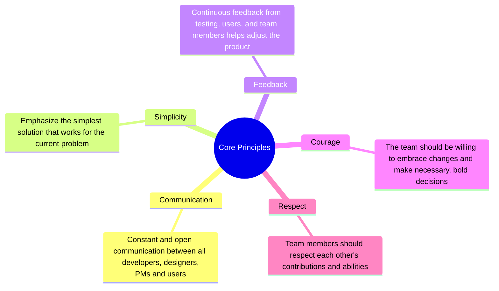

TODO: Add lucide icons to mindmap

import {
User,
Users,
TestTubeDiagonal,
GitPullRequestCreateArrow,
Code,
Feather,
PersonStanding
} from 'lucide-react'

import { Feature } from "@cuhacking/docs/components/ui/feature-section"
import { Accordion, Accordions } from "fumadocs-ui/components/accordion"
import { FUIFeatureSectionWithCards } from "@cuhacking/docs/components/ui/feature"

## Introduction

<Callout title="What's Extreme Programming (XP)?">
- A set of rigorous software development practices built on top of the Agile methodology.
- Rapid release cadence over tiny development cycles.
- Emphasizes Test-Driven Development (TDD), Pair Programming, Continuous Integration, and Collective Code Ownership.
</Callout>

### Core Principles
TODO: Add color schema to mindmap


export const features = [
  {
    title: 'Pair Programming',
    desc: 'Two developers work together at one workstation at the same time, boosting velocity.',
    icon: <User />,
  },
    {
    title: 'Test-Driven Development (TDD)',
    desc: 'Write tests before implementing features, ensuring code meets requirements and maintains high test coverage.',
    icon: <TestTubeDiagonal />,
  },
    {
    title: 'Small Releases',
    desc: 'Release working software frequently, often in small increments, to get feedback and improve based on user needs.',
    icon: <GitPullRequestCreateArrow />,
  },
  {
    title: 'Refactoring',
    desc: 'Regularly improve and optimize code without changing its functionality.',
    icon: <Code />,
  },
    {
    title: 'Sustainable Pace',
    desc: 'Avoid overworking the team to maintain a consistent and sustainable workflow.',
    icon: <Feather />,
  },
   {
    title: 'Collective Code Ownership',
    desc: 'Everyone on the team is responsible for all the code. Encourage collaboration and reduces silos.',
    icon: <Users />,
  },
   {
    title: 'On-Site User',
    desc: 'Have users readily available to clarify requirements and provide immediate feedback',
    icon: <PersonStanding />,
  },
]

<div>
      <FUIFeatureSectionWithCards title={"Key Practices"} description={"Essential principles followed in extreme programming."} features={features} />
</div>

### Feedback loop

    TODO: Check color schema for diagram below
    ```mermaid
    flowchart TB
    A("Code") --> B("Pair Programming") & C("Unit Test") & D("Pair Negotiation") & E("Stand-up meeting") & F("Acceptance Test") & G("Iteration Plan") & H("Release Plan")
    B --> A
    C --> B
    D --> C
    E --> D
    F --> E
    G --> F
    H --> G

    style A stroke:#000000,fill:#F97316,color:#000000,font-weight:bold
    style B stroke:#000000,fill:#EAB308,color:#000000,font-weight:bold
    style C stroke:#000000,fill:#60A5FA,color:#000000,font-weight:bold
    style D stroke:#000000,fill:#02E53F,color:#000000,font-weight:bold
    style E stroke:#000000,fill:#C9C9C9,color:#000000,font-weight:bold
    style F stroke:#000000,fill:#DC2626,color:#000000,font-weight:bold
    style G stroke:#000000,fill:#B6E400,color:#000000,font-weight:bold
    style H stroke:#000000,fill:#116400,color:#000000,font-weight:bold
    ```

<Accordions>
    <Accordion title="What's Agile?">
    - Project management methodology that emphasizes flexibility, rapid iteration, and user satisfaction.
    - Defined by the 4 values and 12 principles of the [Agile Manifesto](https://agilemanifesto.org/principles.html).
    </Accordion>
    
    <Accordion title="How's Extreme Programming related to Agile?">
    Strong emphasis on the following common values:
    - Straightforward communication, simplicity, feedback, and courage.
    - Highly iterative and incremental.
    - User-centric.
    - Encourage change, flexibility and adaptability
    </Accordion>
    
    <Accordion title="How's Extreme Programming different from Agile?">
    - Extreme Programming is a software development methodology, while Agile is a project management methodology.
    - Strong emphasis on technical practices such as TDD, CI/CD, Pair Programming, and Documentation.
    - More prescriptive approach that applies principles the broader Agile framework.
    </Accordion>
</Accordions>

[Extreme Programming - Wikipedia](https://en.wikipedia.org/wiki/Extreme_programming).
