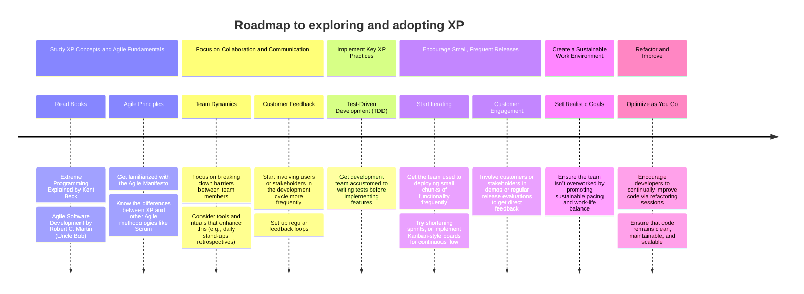

## Map

TODO: Fit with color schema and make it fit into the page better (perhaps splitting into 2...)

```mermaid
timeline
    title Roadmap to exploring and adopting XP
    section Study XP Concepts and Agile Fundamentals
        Read Books: Extreme Programming Explained by Kent Beck: Agile Software Development by Robert C. Martin (Uncle Bob)
        Agile Principles: Get familiarized with the Agile Manifesto: Know the differences between XP and other Agile methodologies like Scrum
    section Focus on Collaboration and Communication
        Team Dynamics: Focus on breaking down barriers between team members : Consider tools and rituals that enhance this (e.g., daily stand-ups, retrospectives)
        Customer Feedback: Start involving users or stakeholders in the development cycle more frequently: Set up regular feedback loops
    section Implement Key XP Practices
        Test-Driven Development (TDD): Get development team accustomed to writing tests before implementing features
    section Encourage Small, Frequent Releases
        Start Iterating: Get the team used to deploying small chunks of functionality frequently: Try shortening sprints, or implement Kanban-style boards for continuous flow
        Customer Engagement: Involve customers or stakeholders in demos or regular release evaluations to get direct feedback
    section Create a Sustainable Work Environment
        Set Realistic Goals: Ensure the team isn’t overworked by promoting sustainable pacing and work-life balance
    section Refactor and Improve
        Optimize as You Go: Encourage developers to continually improve code via refactoring sessions: Ensure that code remains clean, maintainable, and scalable
```
