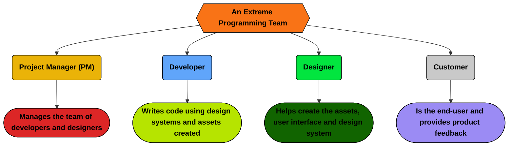

## XP How to

### Project Management

- **Facilitate clear communication** between users and the solution delivery team.
- **Ensure regular feedback** to adapt the product quickly.
- **Encourage testable deliverables** to meet exact user needs, prevent scope creep, and avoid design bankruptcy.
- **Support pair programming** to maintain productivity, improve chemistry, and ensure a sustainable workflow.

### Software Development

- **Write tests** from day one.
- **Pair with developers** to learn and grow faster.
- **Lead retrospectives** to reflect and never make the same mistake twice.
- **Aggressively gather feedback** from users and the team.

### Designer

- **Create guidelines** that are realistic to implement and maintain.
- **Involve developers** to create the design system.
- **Seek feedback** on the usability and aesthetics of the product.
- **Review designs** often to avoid wasted effort and pivot early.

### User

- **Provide examples** to improve communication.
- **Provide frequent demos and reviews** to ensure the solution meets your needs.
- **Stay updated** on the project to help re-prioritize features and provide early feedback.
- **Provide detailed clarifications** throughout the development process.
