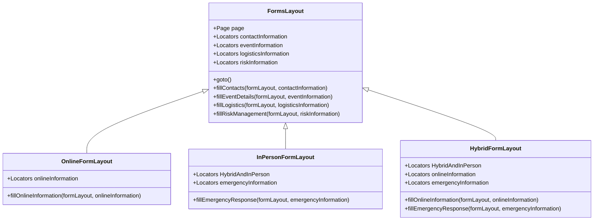

A number of tools developed internally are used to eliminate manual, repetitive work for other teams.

## Community Engagement
### Carleton University Room Booking

[PR #197](https://github.com/cuhacking/2025/pull/179) in-progress by Jeremy Friesen.

To run the scripts, use either one of these commands in the CLI to run a specific workflow:

 - `pnpm nx run risk-form-filler:online` --> for submitting online events
 - `pnpm nx run risk-form-filler:in-person` --> for submitting in-person events
 - `pnpm nx run risk-form-filler:hybrid` --> for submitting hybrid events

<iframe
className="mt-4 w-full h-[400px]"
style={{ border: '1px solid rgba(0, 0, 0, 0.1)' }}
allowFullScreen
src="https://drive.google.com/file/d/1rfcOHtDp1gfar-SZsDOhKrSYpT3lngEP/preview"
width="640"
height="480"
allow="autoplay">
</iframe>

## Sponsorship
### Email Drafts

Work in progress.

Inspired by the following tools authored by Mumtahin Farabi.

For the [CUSEC 2024](https://2024.cusec.net) Sponsorship team.

<iframe
className="mt-4 w-full h-[400px]"
style={{ border: '1px solid rgba(0, 0, 0, 0.1)' }}
src="https://2024.cusec.net/email-drafts"
allowFullScreen>
</iframe>

[View Externally](https://2024.cusec.net/email-drafts)

For the [SPAC 2024](https://www.ieeespac.ca/) Patronage Team.

<iframe
className="mt-4 w-full h-[400px]"
style={{ border: '1px solid rgba(0, 0, 0, 0.1)' }}
allowFullScreen
src="https://drive.google.com/file/d/1frqbRzHBwET4g3jsmSzhFMZZMJhfmd9m/preview"
width="640"
height="480"
allow="autoplay">
</iframe>
