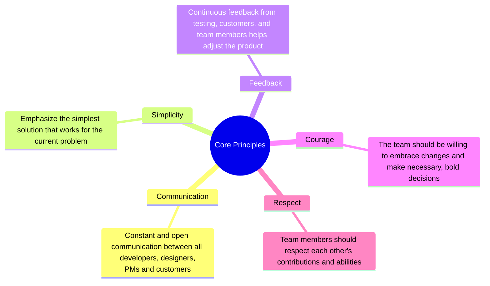

TODO: Add lucide icons to mindmap

import {
  Figma as BrandIcon,
  Code as ESLintIcon,
   Smartphone as HackerPortalIcon,
   Instagram as InstagramIcon,
   AppWindowMac as LandingPageIcon,
   Linkedin as LinkedinIcon,
   Trees as LinktreeIcon,
   SquareKanban as ProjectBoardIcon,
 } from 'lucide-react'

import { Feature } from "@cuhacking/docs/components/ui/feature"
import { Accordion, Accordions } from "fumadocs-ui/components/accordion"

## What is Extreme Programming (XP)?

<Callout title='Extreme Programming (XP) is:'>
- A software development methodology
- Built on top of Agile development principles
- Advocates for frequent releases in short development cycles
- Emphasizes Test-Driven Development (TDD), Pair Programming, Continuous Integration and Collective Code Ownership
</Callout>

### Core Principles of Extreme Programming (XP)
TODO: Add color schema to mindmap


### Key Practices of Extreme Programming (XP)

<Callout title='Key Practices of Extreme Programming (XP)'>
1. **Pair Programming**: Two developers work together at one workstation, enhancing code quality and team collaboration.
2. **Test-Driven Development (TDD)**: Write tests before writing code, ensuring every piece of code works as intended.
3. **Continuous Integration**: Frequently integrate code into the main branch to detect issues early.
4. **Small Releases**: Release working software frequently, often in small increments, to get feedback and improve based on customer needs.
5. **Refactoring**: Regularly improve and optimize code without changing its functionality.
6. **Sustainable Pace**: Avoid overworking the team to maintain a consistent and sustainable workflow.
7. **Collective Code Ownership**: Everyone on the team is responsible for all the code. This encourages collaboration and reduces silos.
8. **On-Site Customer**: Have someone from the customer side available to clarify requirements and provide immediate feedback.

</Callout>

<Accordions>
    <Accordion title="What is Agile development?">
    - It's a project management methodology that emphasizes flexibility and customer satisfaction
    - It follows the Agile Manifesto (which outlines 4 values and 12 principles)
    - The principles behind the Agile Manifesto can be found [here](https://agilemanifesto.org/principles.html)
    </Accordion>
    
    <Accordion title="How is Extreme Programming related to Agile?">
    - Both emphasizes values such as communication, simplicity, feedback, and courage
    - Both methodologies are iterative and incremental
    - Both methodologies are customer-centric
    - Both methodologies embrace change, flexibility and adaptability
    </Accordion>
    
    <Accordion title="How is Extreme Programming different from Agile?">
    - Extreme Programming is a software development methodology, while Agile is a project management methodology
    - Extreme Programming emphasizes technical practices such as Test-Driven Development (TDD), Pair Programming, and Continuous Integration
    - Extreme Programming is a more prescriptive approach within the broader Agile framework
    </Accordion>
    
    <Accordion title="Show me a feedback loop for Extreme Programming">
    TODO: Check color schema for diagram below
    ```mermaid
    flowchart TB
    A("Code") --> B("Pair Programming") & C("Unit Test") & D("Pair Negotiation") & E("Stand-up meeting") & F("Acceptance Test") & G("Iteration Plan") & H("Release Plan")
    B --> A
    C --> B
    D --> C
    E --> D
    F --> E
    G --> F
    H --> G

    style A stroke:#000000,fill:#F97316,color:#000000,font-weight:bold
    style B stroke:#000000,fill:#EAB308,color:#000000,font-weight:bold
    style C stroke:#000000,fill:#60A5FA,color:#000000,font-weight:bold
    style D stroke:#000000,fill:#02E53F,color:#000000,font-weight:bold
    style E stroke:#000000,fill:#C9C9C9,color:#000000,font-weight:bold
    style F stroke:#000000,fill:#DC2626,color:#000000,font-weight:bold
    style G stroke:#000000,fill:#B6E400,color:#000000,font-weight:bold
    style H stroke:#000000,fill:#116400,color:#000000,font-weight:bold
    ```
    </Accordion>
</Accordions>

You can visit this link [here](https://en.wikipedia.org/wiki/Extreme_programming) to learn more about Extreme Programming.

