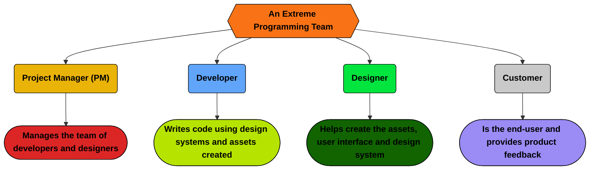

## What an XP Team Looks Like

Below is a diagram of an XP team and their responsibilities:

## How to Execute XP as a PM

A PM's role in XP is to ensure that the team is following the XP practices and principles. This includes:
- **Facilitating clear communication** between customers and the team.
- **Ensuring the team gets regular feedback** to adapt the product quickly.
- **Encouraging simple, test-driven solutions** to meet customer needs without over-complicating the design.
- **Supporting pair programming**, customer collaboration, and ensuring a sustainable workflow.

## How to Execute XP as a Developer

A developer's role in XP is to:
- **Write clean, testable code** that meets the customer's requirements.
- **Collaborate with other developers** through pair programming.
- **Participate in regular stand-ups and retrospectives** to improve the team's workflow.
- **Provide feedback** to the customer and the team to improve the product.

## How to Execute XP as a Designer

A designer's role in XP is to:
- **Create a design system** that is easy to implement and maintain.
- **Work closely with developers** to ensure the design is implemented correctly.
- **Provide feedback** on the usability and aesthetics of the product.
- **Participate in regular design reviews** to improve the design system and assets.

## How to Execute XP as a Customer

A customer's role in XP is to:
- **Provide clear requirements** and feedback to the team.
- **Participate in regular demos and reviews** to ensure the product meets their needs.
- **Collaborate with the team** to prioritize features and provide feedback.
- **Be available for questions and clarifications** throughout the development process.

