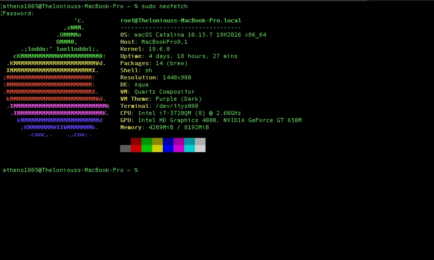
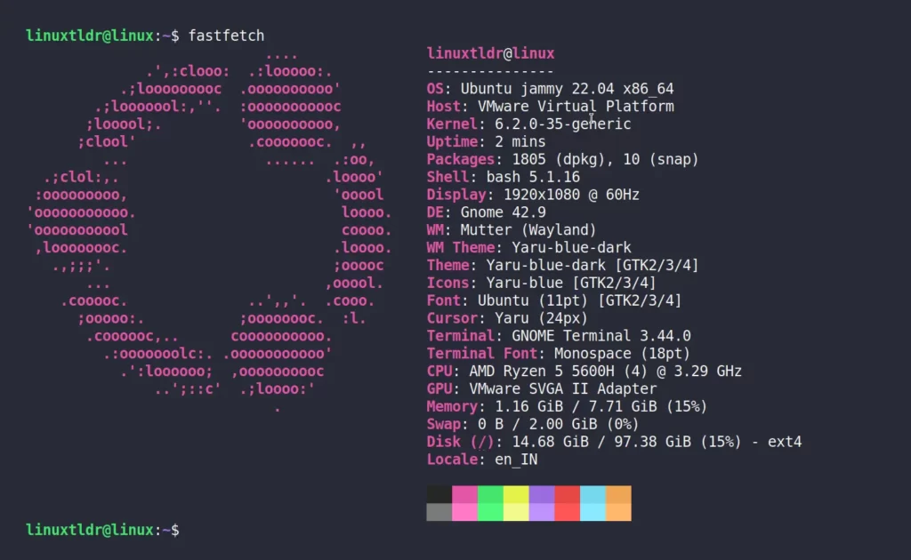
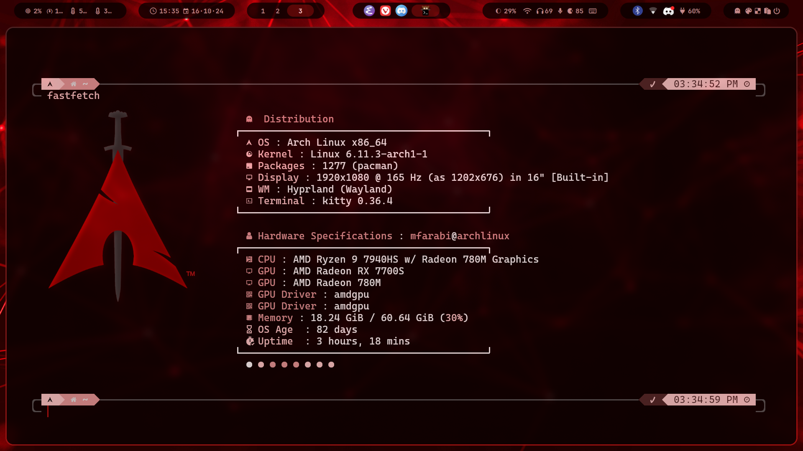

import { File, Folder, Files } from 'fumadocs-ui/components/files';
import { Accordion, Accordions } from "fumadocs-ui/components/accordion";

## Shell Navigation

<Callout title="Helpful Notes">
- The shell is what we use to send commands directly to the kernel.
- 'Shell' and 'Terminal' are generally the same thing.
- The term `directory` means the same thing as folder.
- The `~` symbol represents the home directory in both Linux and Unix (MacOS is UNIX).
- Everything in Linux is a file.
- Every command begins with a program name.
- You can learn more about the program using the `man` program.

You can open your terminal in MacOS by searching for it in [Spotlight](https://support.apple.com/en-ca/guide/mac-help/mchlp1008/mac).

For windows users, do <kbd>Win+X, I</kbd> to open the terminal.
- It will probably open in the default Powershell/CMD profile, click the dropdown and switch to Ubuntu.

```sh title="Terminal"
man cd
```
Press `q` to quit. You can put almost any program after the `man` command to learn more about it. You can even do `man man`.

We recommend typing in the commands by hand rather than copy-pasting, because:
- You'll learn quicker
- You'll be quicker
- You'll retain the information better
- You'll become more comfortable with the terminal
</Callout>

    <div className="steps">
      <div className="step">
        ### See current location
        To see where we currently are, we use `pwd`.
        ```sh title="Terminal"
        pwd
        ```
        Your output can be different, but will definitely have slashes like this:
        ```
        /home/yourusername
        ```

        `pwd` means 'print current directory'. This is our current location.
</div>
      <div className="step">
        ### See files in current location
        To see what files and directories are around us, we use `ls`.
        ```sh title="Terminal"
        ls
        ```

        `ls` means 'list'.


`ls -a` will show us all of our files and directories, including hidden ones.
        ```sh title="Terminal"
        ls -a
        ```
</div>
      <div className="step">
        ### Go to the home directory
        To move between directories, we use the `cd` command.
        ```sh title="Terminal"
        cd ~
        ```
        `cd` means 'change directory'. You can use `pwd` again to see where you are.
</div>

      <div className="step">
        ### Make a directory called `workspace`
        To create directories, we use the `mkdir` command.
        ```sh title="Terminal"
        mkdir workspace
        ```
 `mkdir` means (make directory) command
</div>

      <div className="step">
        ### Go into the `workspace` directory
        ```sh title="Terminal"
        cd workspace
        ```
</div>

      <div className="step">
        ```sh title="Terminal"
        mkdir hack-the-tunnels-git-workshop
        ```

</div>

      <div className="step">
        ### Go into the `hack-the-tunnels-git-workshop` directory
        ```sh title="Terminal"
cd hack-the-tunnels-git-workshop
        ```

<Accordions>
<Accordion title="How do I go back one directory?">
        ```sh title="Terminal"
        cd ..
        ```
        ```sh title="Terminal"
        # See where you are
        ls -a
        ```
        ```sh title="Terminal"
        # Go back into `hack-the-tunnels-git-workshop` to continue
        cd hack-the-tunnels-git-workshop
        ```
</Accordion>
</Accordions>
</div>

      <div className="step">
      ### Try the `echo` command
        ```sh title="Terminal"
        echo "Hack the Tunnels"
        ```
        You will then see the output:
        ```
        Hack the Tunnels
        ```
        This command is used to print things, just like `print()` in Python, and `console.log()` in JavaScript. Replace the text between the double quotes with anything you like and try again :)

`man echo` if you want to learn more. You can quit man pages by pressing `q`.
</div>

      <div className="step">
        ### Create a file
        ```sh title="Terminal"
        touch file.sh
        ```
        `touch` creates files. `man touch` to learn more.
</div>

      <div className="step">
        ### Check that file was created
        ```sh title="Terminal"
        ls -a
        ```
        You'll now see `file.sh` show up in the output.
</div>

      <div className="step">
        ### Edit the file
        Let's open [VS Code](https://code.visualstudio.com) in this directory so that we can edit the file.
        ```sh title="Terminal"
        code -r .
        ```
        The `-r` flag means re-use the same VS Code window if one exists. The `.` means this current directory.
</div>

    </div>

<Callout title="Tip">
Using lowercase letters and hyphens with no spaces for file and folder names will make script automation much easier.
</Callout>

## Make a Bash Script

At this point, your file tree (Explorer) in VS Code should look like this:
<Files>
  <Folder name="hack-the-tunnels-git-workshop" defaultOpen>
  <File name="file.sh" />
  </Folder>
</Files>


      <div className="steps">
      <div className="step">
      ### Open VS Code terminal
You can open/close the VS Code terminal with <kbd>&#8984;/Ctrl + `</kbd>.
</div>

      <div className="step">
      ### Open `file.sh`

        ```sh title="file.sh"
        code -r file.sh
        ```
        You'll see the tab open in your VS Code.
</div>

      <div className="step">
      ### Edit `file.sh`

Add the following:
        ```sh title="file.sh"
        #!/bin/bash // [!code highlight]
        ```
        This indicates to Linux/Unix that this is a bash script.
        <Callout type="warn" title="If you see a dot next to filename in the tab, that means it's not saved.">
        You can save the file with <kbd>&#8984;/Ctrl + S</kbd>. Always ensure to save before moving on.
        </Callout>
</div>
<div className="step">
### Check if `echo` works in the VS Code terminal
        ```sh title="Terminal"
        echo "Hack the Tunnels"
        ```
        You will then see the output:
        ```
        Hack the Tunnels
        ```

It works, let's add it to the file.

    ```txt title="file.sh"
    #!/bin/bash
    echo "Hack the Tunnels" // [!code highlight]
    ```
</div>

<div className="step">
Run the file

        ```sh title="Terminal"
        ./file.sh
        ```
        You should see:
        ```
        bash: permission denied: ./file.sh
        ```

<Accordions>
<Accordion title="What happened there?">
This is similar to how you're asked for permissions when installing a program.

The 'installer' program needs to run on your machine to install the program, and you provide the permission.
</Accordion>
</Accordions>

        Let's fix it by giving it permissions.
        ```sh title="Terminal"
        sudo chmod +x ./file.sh
        ```
        Run it again.
        ```sh title="Terminal"
        ./file.sh
        ```
        You should see:
        ```
        Hack the Tunnels
        ```

<Accordions>
<Accordion title="How did that work?">
`sudo` is 'super user do', which is admin permissions.
- The admin user in Linux is called the 'root' user.

`chmod` is 'change mode', with `+x` being the executable permission.

`sudo chmod +x anyfilename.sh` is the root user providing the file execution permissions.

All operating systems do the same thing under the hood on your behalf when you press the buttons.
</Accordion>
</Accordions>

<div className="step">
### Make a cow say "Hack the Tunnels"
        ```sh title="Terminal"
        brew install cowsay
        ```
        ```sh title="Terminal"
        cowsay "Hack the Tunnels"
        ```
```
 __________________
< Hack the Tunnels >
 ------------------
        \   ^__^
         \  (oo)\_______
            (__)\       )\/\
                ||----w |
                ||     ||
```
</div>

<div className="step">
### `fastfetch`, `cmatrix`, and `lolcat`

Rather than installing programs one by one, we can install multiple in a single command.

```sh title="Terminal"
brew install fastfetch cmatrix lolcat
```

When someone asks:

> What are your specs?

We show them this.

```sh title="Terminal"
fastfetch
```

Output varies on your OS.

<Tabs items={["Unix (MacOS)", "GNU/Linux (Ubuntu - WSL)", "GNU/Linux (Arch Linux - Bare Metal)"]}>

<Tab value="Unix (MacOS)">



</Tab>

<Tab value="GNU/Linux (Ubuntu - WSL)">



</Tab>

<Tab value="GNU/Linux (Arch Linux - Bare Metal)">



</Tab>
</Tabs>

Very cool. Now, let's allow ourselves to feel like hackers.
```sh title="Terminal"
cmatrix
```
Press <kbd>q</kbd> to quit.

Now, let's allow ourselves to feel like hackers but in RGB.
```sh title="Terminal"
cmatrix | lolcat
```
Press <kbd>q</kbd> to quit.

<Accordions>
<Accordion title="What does the `|` do?">
This is called the 'pipe' symbol.

We took the output of `cmatrix` and directed it into `lolcat`.

This technique is referred to as 'piping'. We can pipe the output of one program into another.
</Accordion>
</Accordions>

Let's make a cow say "Hack the Tunnels".
```sh title="Terminal"
cowsay "Hack the Tunnels"
```

Let's make a cow say "Hack the Tunnels" but in a RGB.

<Callout title="Notes">
You can hit the up arrow key on your keyboard to see past commands.
</Callout>

```sh title="Terminal"
cowsay "Hack the Tunnels" | lolcat
```

Change the text inside the quotes and try it a few more times to see what happens :)

<div className="step">
### Automate away
<Callout title="Notes">
Any command you can run in the terminal, you can also write into the file and run.
</Callout>

Let's try cowsay.

```txt title="file.sh"
#!/bin/bash
echo "Hack the Tunnels"
cowsay "Hack the Tunnels" | lolcat // [!code highlight]
```

Let's spam cowsay because why not.
```txt title="file.sh"
#!/bin/bash
echo "Hack the Tunnels"
cowsay "Hack the Tunnels" | lolcat // [!code highlight]
cowsay "Hack the Tunnels" | lolcat // [!code highlight]
cowsay "Hack the Tunnels" | lolcat // [!code highlight]
cowsay "Hack the Tunnels" | lolcat // [!code highlight]
cowsay "Hack the Tunnels" | lolcat // [!code highlight]
cowsay "Hack the Tunnels" | lolcat // [!code highlight]
```

Save, and run the file again :)

```sh title="Terminal"
./file.sh
```

</div>
</div>

</div>
</div>
