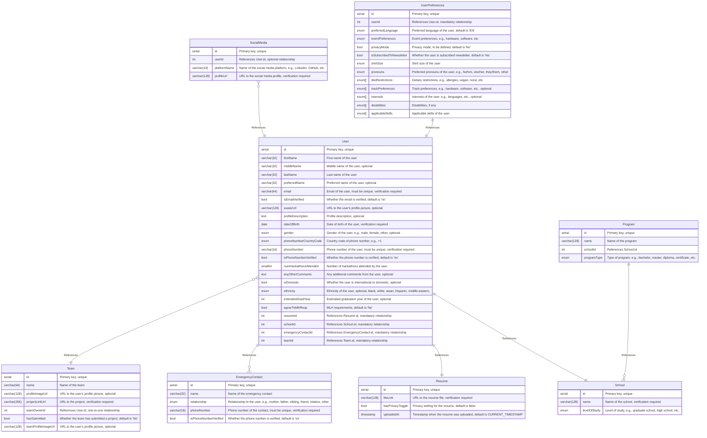

## 📦 Overview

### What it does

This library holds the schemas and commands for making and using the database using DrizzleORM and Drizzle-Kit.
It puts together the schemas in a configuration, and provides one database object to interact with databases with type-safety.

### Mermaid Entity-Relationship Diagram

Here is the Mermaid ERD for the portal database schema:



### Key Features

- One source of truth
- Isolated tests
- [Blazingly fast](https://github.com/cuhacking/2025/issues/49)
- Caching enabled ✅

### How to use

#### Basic Usage Example

This library requires a `DATABASE_URL` environment variable, which is the connection
string to a PostgreSQL database. This means of course it will require a PostgreSQL
database up and running, which is why we have a `docker-compose` file.
To spin up a database on a local development container, run `docker-compose up -d`
This container can be taken down afterwards with `docker-compose down`.

---

## 📖 API Reference

### `db`

- **Description**: Database interactor object, allowing for performing querries and mutations. 

Schemas are exported as well, and are used to perform operations on their tables in the database.

### Error Handling

This library does not perform any error handling currently.

---

## 🛠️ Commands

### View all commands

To view all commands from the library's `project.json`, `package.json` and inheritted:
```sh title="Terminal"
pnpm nx show project db
```

### Focus library usage

To view/focus on all the apps & libraries which use this library:
```sh title="Terminal"
pnpm nx graph --focus db
```

### Run Drizzle studio

To view database tables & more, Drizzle provides a studio:
```sh title="Terminal"
pnpm nx run db:studio
```

### Other Drizzle-Kit commands

All other `drizzle-kit` [commands](https://orm.drizzle.team/kit-docs/commands) are supported, such as `generate` and `migrate`.
See the project graph to view them. Here is an example of running a migration:
```sh title="Terminal"
pnpm nx run db:migrate
```

---

## 📝 Contributing

### Best Practices

#### Code Formatting

To create a new entity, simply create the exported schema. It will be automatically
imported into `drizzle-kit`, at which point you can perform a migration to use the updated
schemas. You may be asked some questions, i.e. if a column was renamed or newly added.
Eventually, some migrations may require to truncate (delete) all of the data in the database.
One cause of this is new columns having a required field -> you can imagine that drizzle does not
know what to put for each row for that newly required field!

The library should be linted without any errors:
```sh title="Terminal"
pnpm nx run db:lint
```

#### Testing

To run tests for this library:
```sh title="Terminal"
pnpm nx run db:test
```

---

## ❓ FAQs

### What do I do if I don't want to truncate data?

One possible way to go about this is to make the newly added required attribute an optional one instead.
Make sure that it is valid to make it optional.

---

## 🛑 Troubleshooting

### Common Errors

#### Migration could not be completed

If this happens, a last resort solution would be to delete the docker container & its volume,
and attempt a migration once again.

For more troubleshooting, see DrizzleORM's [troubleshooting page](https://orm.drizzle.team/kit-docs/faq).
