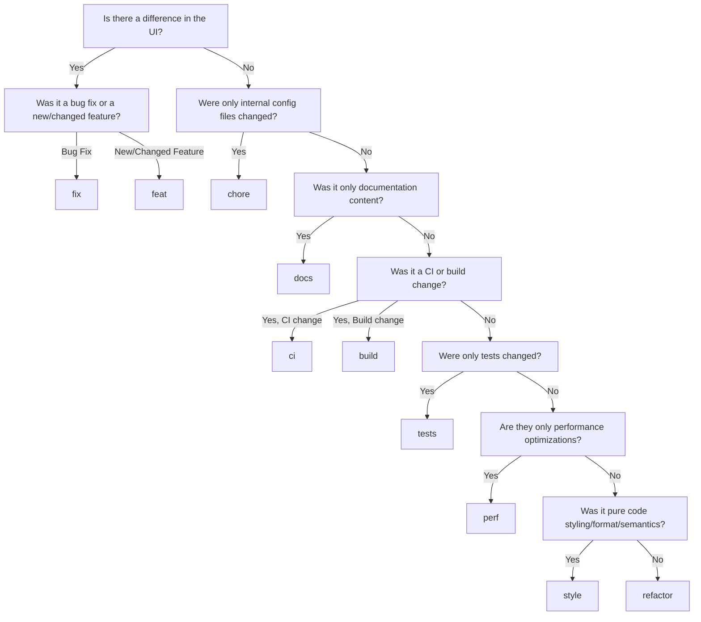

<Callout>
  If you want to be cool, make sure to rebase onto `main` before continuing
  work.
</Callout>

We follow the [Conventional
Commits](https://www.conventionalcommits.org/en/v1.0.0/) specification for
commit messages.

When you hit `enter` after doing `git commit`, it will trigger a [Git Hook](https://git-scm.com/book/en/v2/Customizing-Git-Git-Hooks) managed by [Husky](https://typicode.github.io/husky/), which triggers a [Commitlint](https://commitlint.js.org/) command to verify that your commit message meets the specified guidelines. Any messages that do not follow the specification will be rejected with feedback locally.

In order to ease the process of learning the specification and writing compliant commit messages, we've configured [Commitizen](https://commitizen-tools.github.io/commitizen/) to guide you through the process of writing a commit message interactively.
You can run `pnpm commit` to use this tool. This will guarantee that your commit messages are formatted correctly.

With time, writing conventional commit messages will become second nature and you will no longer need to use Commitizen :)

- Each commit should be a single logical change. Don't make several logical changes in one commit. For example, if a patch fixes a bug and optimizes the performance of a feature, split it into two separate commits.
- Each commit should be able to stand on its own, and each commit should build on the previous one. This way, if a commit introduces a bug, it should be easy to identify and revert.
- Each commit should be deployable and not break the build, tests, or functionality.
- If you're not sure if a commit should be split, it's better to split it if each commit is deployable and doesn't break the build, tests, or functionality.
- If you fixed changes in a past commit, use `git commit --amend` to add changes to the previous commit rather than creating a new one; thus keeping the commit history clean and concise.
  - Only exception to this is if the commit already existed on the `main` branch, in which case a fixup commit should be made rather than an amend. If that commit is amended and force pushed, it will diverge the git history for the entire team.
- If you ever amend, reorder, or rebase, your local branch will become divergent from the remote for the amended commit(s), so GitHub won't let you push. Simply force push to overwrite your old branch: `git push --force-with-lease`.

